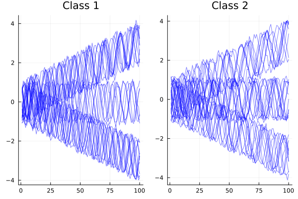

```@meta
# Draft = true
```
# [Classification](@id Classification_top)

This tutorial for MPSTime will take you through the basic steps needed to fit an MPS to a time-series dataset.

## [Demo dataset](@id nts_demo)

First, import or generate your data. Here, we generate a two class "noisy trendy sine" dataset for the sake of demonstration, but if you have a dataset in mind, you can skip to the next section. Our demonstration dataset consists of a sine function with a randomised phase, plus a linear trend, plus some normally distributed noise. Each ``T``-length time series in class ``c`` at time ``t`` is given by:

```math
x^c_t = \sin{\left(\frac{2\pi}{\tau}t + \psi\right)} + \frac{mt}{T} + \sigma_c n_t\,,
```

where ``\tau`` is the period, ``m`` is the slope of a linear trend, ``\psi \in [0, 2\pi)`` is a uniformly random phase offset, ``\sigma_c`` is the noise scale, and ``n_t \sim \mathcal{N}(0,1)`` are  normally distributed random variables. 

For the demonstration dataset, the two classes will be generated with different distributions of periods. The class one time series ``x^1`` have ``\tau \in[12, 15]``, and the class two time series ``x^2`` will have``\tau \in[16, 19]``. We'll use ``\sigma_c = 0.2``, and the slope ``m`` will be randomly selected from ``\{-3,0,3\}``.


We'll set up this dataset using the [`trendy_sine`](@ref) function from MPSTime.
 
```@example classification; output=false
using MPSTime, Random
rng = Xoshiro(1); # fix rng seed
ntimepoints = 100; # specify number of samples per instance
ntrain_instances = 300; # specify num training instances
ntest_instances = 200; # specify num test instances
X_train = vcat(
    trendy_sine(ntimepoints, ntrain_instances ÷ 2; sigma=0.1, slope=[-3,0,3], period=(12,15), rng=rng)[1],
    trendy_sine(ntimepoints, ntrain_instances ÷ 2; sigma=0.1, slope=[-3,0,3], period=(16,19), rng=rng)[1]
);
y_train = vcat(
    fill(1, ntrain_instances ÷ 2),
    fill(2, ntrain_instances ÷ 2)
);
X_test = vcat(
    trendy_sine(ntimepoints, ntest_instances ÷ 2; sigma=0.2, slope=[-3,0,3], period=(12,15), rng=rng)[1],
    trendy_sine(ntimepoints, ntest_instances ÷ 2; sigma=0.2, slope=[-3,0,3], period=(16,19), rng=rng)[1]
);
y_test = vcat(
    fill(1, ntest_instances ÷ 2),
    fill(2, ntest_instances ÷ 2)
);
nothing # hide
```

```@example classification
using Plots
p1 = plot(X_train[1:30,:]'; colour="blue", alpha=0.5, legend=:none, title="Class 1");
p2 = plot(X_train[end-30:end,:]'; colour="blue", alpha=0.5, legend=:none, title="Class 2");
plot(p1,p2)
savefig("./figs_generated/classification_classes.svg") # hide
nothing # hide
```



## [Training an MPS](@id classification_training)
!!! warning "Floating Point Error"
    Depending on the dataset, the results of `fitMPS` can be noticeably affected by what machine it is running on. If you're trying to replicate these
    tutorials, expect a classification uncertainty of 1-2% (the noisy trendy sine can be something of an extreme case). You can resolve this by either using higher precision computing (pass `dtype=BigFloat` or `Complex{BigFloat}` to [`MPSOptions`](@ref)), or use the [`evaluate`](@ref) function to resample 
    your data and average the result. This is generally not significant for scientific computing applications as for real word datasets, the floating point error of up to a few percent is much less than the resampling error caused by choosing different train/test splits.


To train an MPS on your dataset, first, set up the hyperparameters (see [`Hyperparameters`](@ref c_hparams)):
```@repl classification
opts = MPSOptions(); # calling this with no arguments gives default hyperparameters
print_opts(opts; long=false); # pretty print the options table
```

and then pass the data and hyperparameters to the [`fitMPS`](@ref) function:

```julia-repl
julia> mps, info, test_states = fitMPS(X_train, y_train, X_test, y_test, opts);
``` 

!!! details "output collapsed"

    ```@repl classification
    mps, info, test_states = fitMPS(X_train, y_train, X_test, y_test, opts);
    ```

[`fitMPS`](@ref) doesn't use `X_test` or `y_test` for anything except printing performance evaluations, so it is safe to leave them blank. For unsupervised learning, input a dataset with only one class, or only pass `X_train` ( `y_train` has a default value of `zeros(Int, size(X_train, 1))` ).

The `mps::TrainedMPS` can be passed directly to [`classify`](@ref) for classification, or [`init_imputation_problem`](@ref) to set up an imputation problem. `info` provides a short training summary, which can be pretty-printed with the [`sweep_summary`](@ref) function.

You can use also `test_states` to print a summary of the MPS performance on the test set.
```@example classification
get_training_summary(mps, test_states; print_stats=true);   

```

## [Hyperparameters](@id c_hparams)

There are number of hyperparameters and data preprocessing options that can be specified using `MPSOptions(; key=value)`


```@docs
MPSOptions
```

## Classification
To predict the class of unseen data, use the [`classify`](@ref) function.

```@docs
classify(::TrainedMPS, ::AbstractMatrix)
```

For example, for the noisy trendy sine from earlier:
```@repl classification
predictions = classify(mps, X_test);
using StatsBase
mean(predictions .== y_test)
```

## Training with a custom basis
To train with a custom basis, first, declare a custom basis with [`function_basis`](@ref), and pass it in as the last argument to [`fitMPS`](@ref). For this to work, the encoding hyperparameter must be set to `:Custom` in `MPSOptions`

```@example classification
using LegendrePolynomials
function legendre_encode(x::Float64, d::Int)
    # default legendre encoding: choose the first n-1 legendre polynomials

    leg_basis = [Pl(x, i; norm = Val(:normalized)) for i in 0:(d-1)] 
    
    return leg_basis
end
custom_basis = function_basis(legendre_encode, false, (-1., 1.))
```

```julia-repl
julia> mps, info, test_states = fitMPS(X_train, y_train, X_test, y_test, MPSOptions(; encoding=:Custom), custom_basis);
```

!!! details "output collapsed"

    ```@repl classification
    mps, info, test_states = fitMPS(X_train, y_train, X_test, y_test, MPSOptions(; encoding=:Custom), custom_basis);
    ```


## Docstrings

```@docs
fitMPS(::Matrix, ::Vector, ::Matrix, ::Vector, ::MPSOptions, ::Nothing)
sweep_summary(io::Union{Nothing,IO}, info)
get_training_summary(io::IO, mps::TrainedMPS, test_states::EncodedTimeSeriesSet)
print_opts
```
