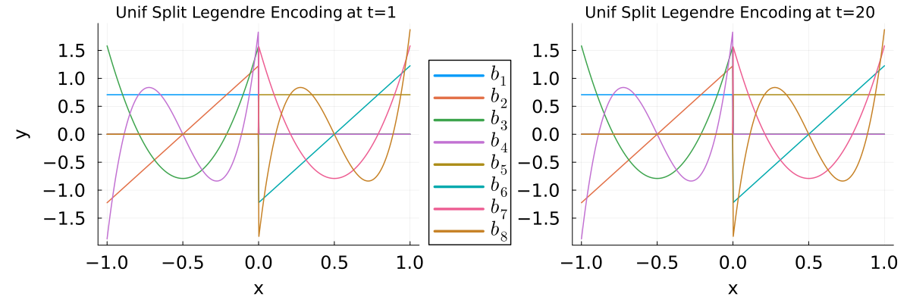

```@meta
DocTestSetup = quote
    using MPSTime, Random
    rng = Xoshiro(1); # fix rng seed
    ntimepoints = 100; # specify number of samples per instance.
    ntrain_instances = 600; # specify num training instances
    ntest_instances = 300; # specify num test instances
    X_train = trendy_sine(ntimepoints, ntrain_instances; sigma=0.2, slope=3, period=15, rng=rng)[1];
    X_test = trendy_sine(ntimepoints, ntest_instances; sigma=0.2, slope=3, period=15, rng=rng)[1];
end
```
# Encodings
## Overview
To use MPS methods on time-series data, the continuous time-series amplitudes must be mapped to MPS compatible vectors using an *encoding*. There are a number of encodings built into this library, and they can be specified by the `encoding` keyword in [`MPSOptions`](@ref).

```@docs
Encoding
```

Encodings can be visualized with the [`plot_encoding`](@ref) function.

```@example encs
using MPSTime
basis, p = plot_encoding(:legendre, 4)
```
<!--  -->


For data-driven bases, the data histograms can be plotted alongside for reference:
```@example encs
# Generate the  Noisy Trendy Sine dataset from the imputation section
using Random 
rng = Xoshiro(1); # fix rng seed
ntimepoints = 100; # specify number of samples per instance.
ntrain_instances = 600; # specify num training instances
ntest_instances = 300; # specify num test instances
X_train = trendy_sine(ntimepoints, ntrain_instances; sigma=0.2, slope=3, period=15, rng=rng)[1];
X_test = trendy_sine(ntimepoints, ntest_instances; sigma=0.2, slope=3, period=15, rng=rng)[1];


# Plot a data-driven basis
basis, p = plot_encoding(:sahand_legendre_time_dependent, 4, X_train; tis=[1,20]); # X_train is taken from the noisy trendy sine demo in the Imputation section
```
<!--  -->

## Using a SplitBasis encoding

One way to increase the encoding dimension is to repeat a basis many times across the encoding domain in 'bins'. In theory, this can be advantageous when data is concentrated in narrow regions in the encoding domain, as very fine bins can be used to reduce encoding error in well-populated regions, while computational effort can be saved with wide bins in sparsely-population regions. To this end, we provide the "Split" bases.

The uniform-split encoding, which simply bins data up as a proof of concept:

```@example encs
basis, p = plot_encoding(uniform_split(:legendre), 8, X_train; tis=[1,20], aux_basis_dim=4);
```

<!--  -->

And the histogram-split encoding, which narrows the bins in frequently occurring regions.

```@example encs
basis, p = plot_encoding(histogram_split(:legendre), 8, X_train; tis=[1,20], aux_basis_dim=4);
```
<!--  -->

Every data-independent encoding can be histogram split and uniform split, including other split bases:

```@example encs
basis, p = plot_encoding(histogram_split(uniform_split(:legendre)), 16, X_train; tis=[1,20], aux_basis_dim=8, size=(1600,900));
```

<!--  -->


## Custom encodings

Custom encodings can be declared using [`function_basis`](@ref).

```@docs
function_basis
```

To use a custom encoding, you must manually pass it into [`fitMPS`](@ref).

```jldoctest encs; filter=[r"random state 1234\.(.*)"s => "random state 1234."]

# Declare a 'custom basis'
using LegendrePolynomials
function legendre_encode(x::Float64, d::Int)
    # default legendre encoding: choose the first n-1 legendre polynomials

    leg_basis = [Pl(x, i; norm = Val(:normalized)) for i in 0:(d-1)] 
    
    return leg_basis
end
custom_basis = function_basis(legendre_encode, false, (-1., 1.))
fitMPS(X_train, MPSOptions(; encoding=:Custom), custom_basis)

# output
Generating initial weight MPS with bond dimension χ_init = 4
        using random state 1234.
```

```@docs
plot_encoding(::Symbol, ::Integer)
```
