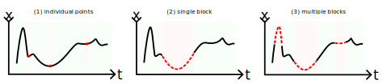
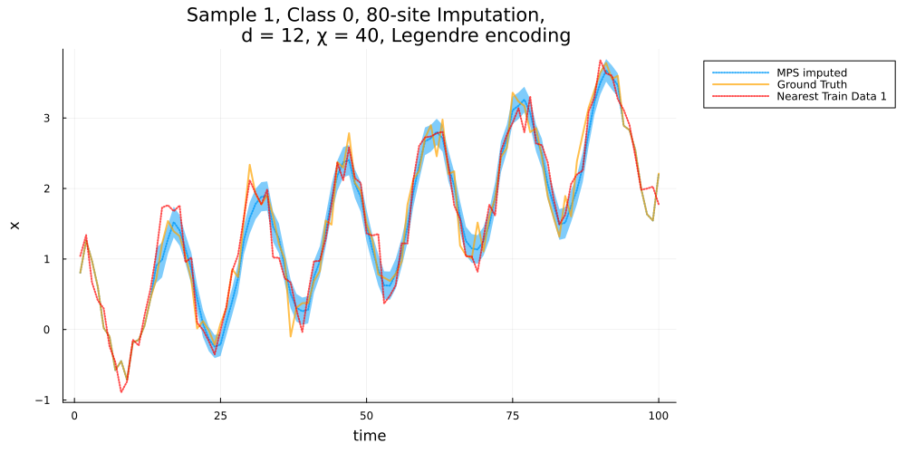
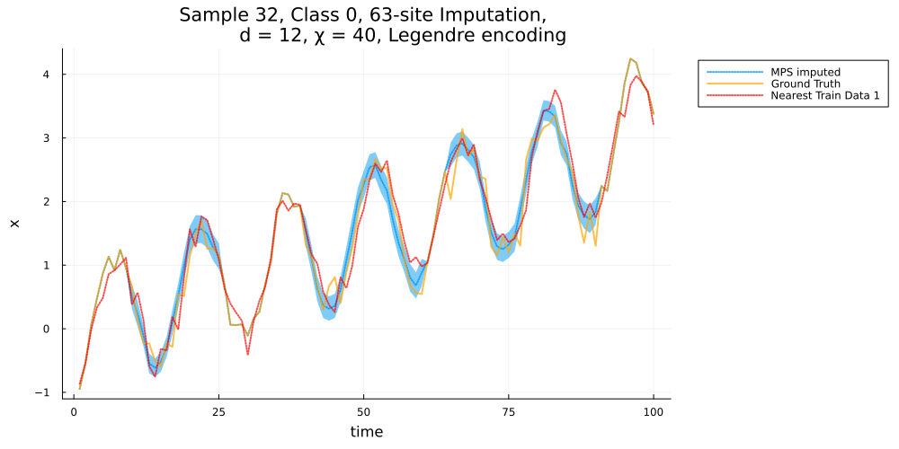
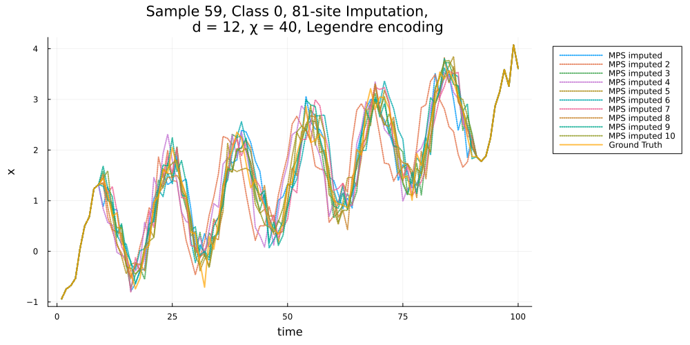

```@meta
Draft = false
```
# [Imputation](@id Imputation_top)
## Overview 
#### Imputation Scenarios
MPSTime supports univariate time-series imputation with three key patterns of missing data:
1. Individual missing points (e.g., values missing at $t = 10, 20, 80$)
1. Single contiguous blocks (e.g., values missing from $t = 25-70$)
1. Multiple contiguous blocks (e.g., values missing from $t = 5-10$, $t = 25-50$ and $t = 80-90$)



MPSTime can also handle any combination of these patterns.
For instance, you might need to impute a single contiguous block from $t = 10-30$, plus individual missing points at $t = 50$ and $t=80$.

## Setup

The first step is to train an MPS. Here, we'll train an MPS in an unsupervised manner (no class labels) using an adapted version of the noisy trendy sinusoid dataset from the [`Classification`](@ref nts_demo) tutorial.

```@example imputation; continued=true
using MPSTime, Random 
rng = Xoshiro(1); # fix rng seed
ntimepoints = 100; # specify number of samples per instance.
ntrain_instances = 300; # specify num training instances
ntest_instances = 200; # specify num test instances
X_train = trendy_sine(ntimepoints, ntrain_instances; sigma=0.2, slope=3, period=15, rng=rng)[1];
X_test = trendy_sine(ntimepoints, ntest_instances; sigma=0.2, slope=3, period=15, rng=rng)[1];
# hyper parameters and training
opts = MPSOptions(
    d=12, 
    chi_max=40, 
    sigmoid_transform=false # disabling preprocessing generally improves imputation performance.
) 
mps, info, test_states = fitMPS(X_train, opts);

nothing # hide
```

Next, we initialize an imputation problem. This does a lot of necessary pre-computation:
```@example imputation
imp = init_imputation_problem(mps, X_test)
nothing # hide

```
A summary of the imputation problem setup is printed to verify the model parameters and dataset information.
For __multi-class__ data, you can pass `y_test` to `init_imputation_problem` in order to exploit the labels / class information while doing imputation.

## Imputing missing values
### Single-block Imputation
Now, decide how you want to impute the missing data.
The necessary options are:
- `class::Integer`: The class of the time-series instance we are going to impute, leave as zero for "unlabelled" data (i.e., all data belong to the same class).
- `impute_sites`: The MPS sites (time points) that are missing (inclusive).
- `instance_idx`: The time-series instance from the chosen class in the test set.
- `method`: The imputation method to use. Can be trajectories (ITS), median, mode, mean, etc...

In this example, we will consider a single block of contiguous missing values, simulated from a missing-at-random mechanism (MAR).
We will use the _median_ to impute the missing values, as well as computing a 1-Nearest Neighbor Imputation (1-NNI) benchmark for comparison:   

```@example imputation
rng = Xoshiro(42) # Fix RNG
class = 0
pm = 0.8 # 80% missing data
instance_idx = 1 # pick a time series instance in test set
_, impute_sites = mar(X_test[instance_idx, :], pm; rng=rng) # simulate MAR mechanism
method = :median

imputed_ts, pred_err, target_ts, stats, plots = MPS_impute(
    imp,
    class, 
    instance_idx, 
    impute_sites, 
    method; 
    NN_baseline=true, # whether to also do a baseline imputation using the (first) Nearest Neighbour benchmark
    plot_fits=true, # whether to plot the fits
    get_wmad=true # when method=:median, this uses the Weighted Median Absolute Deviation (WMAD) to compute the prediction error.
);

# Pretty-print the stats
using PrettyTables
pretty_table(stats[1]; header=["Metric", "Value"], header_crayon=crayon"yellow bold", tf=tf_unicode_rounded);
```
Several outputs are returned from `MPS_impute`:
- `imputed_ts`: The imputed time-series instance, containing the original data points and the predicted values.
- `pred_err`: The prediction error for each imputed value, given a known ground-truth.
- `target_ts`: The original time-series instance containing missing values.
- `stats`: A collection of statistical metrics (MAE and MAPE) evaluating imputation performance with respect to a ground truth. Includes benchmark performance when `NN_baseline=true`.
- `plots`: Stores plot object(s) in an array for visualization when `plot_fits=true`.


The MAE and MAPE in the 'stats' table are the Mean Absolute Error and Mean Absolute Percentage Error for the MPS prediction, while the NN_ prefix corresponds to the same errors for the 1-Nearest Neighbours benchmark. In this case, MAPE is an unreliable measure of error as the data goes through zero. 


To plot the imputed time series, we can call the plot function as follows: 
```@example imputation
using Plots
plots[1]
savefig("figs_generated/imputation/median_impute_1.svg") # hide
nothing # hide
```



The solid orange line depicts the "ground-truth" (observed) time-series values, the dotted blue line is the MPS-imputed data points and the dotted red line is the 1-NN benchmark.
The blue shading indicates the uncertainty due to encoding error.

There are a lot of other options, and many more imputation methods to choose from! See [`MPS_impute`](@ref) for more details.

### Multi-block Imputation
Building on the previous example of single-block imputation, MPSTime can also be used to impute missing values in multiple blocks of contiguous points. 
For example, consider missing points between $t = 10-25$, $t = 40-60$ and $t = 75-90$:
```@example imputation
class = 0
impute_sites = vcat(collect(10:25), collect(40:60), collect(65:90))
instance_idx = 32
method = :median

imputed_ts, pred_err, target_ts, stats, plots = MPS_impute(
    imp,
    class, 
    instance_idx, 
    impute_sites, 
    method; 
    NN_baseline=true, # whether to also do a baseline imputation using the (first) Nearest Neighbour benchmark
    plot_fits=true, # whether to plot the fits
    get_wmad=true,
);
pretty_table(stats[1]; header=["Metric", "Value"], header_crayon=crayon"yellow bold", tf=tf_unicode_rounded);
```
```@example imputation
plots[1]
savefig("figs_generated/imputation/median_impute_nblocks.svg") # hide
nothing # hide
```



### Individual Point Imputation
To impute individual points rather than ranges of consecutive points (blocks), we can simply pass their respective time points into the imputation function as a vector:
```@repl imputation
impute_sites = [10]; # only impute t = 10
impute_sites = [10, 25, 50]; # impute multiple individual points
```


## Plotting Trajectories
To plot individual trajectories from the conditional distribution, use `method=:ITS`. 
Here, we'll plot 10 randomly selected trajectories for the missing points by setting the `num_trajectories` keyword: 
```@example imputation
class = 0
impute_sites = collect(10:90)
instance_idx = 59
method = :ITS

imputed_ts, pred_err, target_ts, stats, plots = MPS_impute(
    imp,
    class, 
    instance_idx, 
    impute_sites, 
    method; 
    NN_baseline=false, # whether to also do a baseline imputation using 1-NN
    plot_fits=true, # whether to plot the fits
    num_trajectories=10, # number of trajectories to plot
    rejection_threshold=2.5 # limits how unlikely we allow the random trajectories to be.
    # there are more options! see [`MPS_impute`](@ref)
);

stats
```

```@example imputation
plots[1]
savefig("./figs_generated/imputation/ITS_impute.svg") # hide
nothing #hide
```



## Plotting cumulative distribution functions

It can be interesting to inspect the probability distribution being sampled from at each missing time point. 
To enable this, we provide the [`get_cdfs`](@ref) function, which works very similarly to [`MPS_impute`](@ref), only it returns the CDF at each missing time point in the encoding domain. Currently only supports `method=:median`.

```@example imputation
using Plots
cdfs, ts, pred_err, target = get_cdfs(
    imp,
    class, 
    instance_idx, 
    impute_sites, 
    # method; # Only supports method=:median
)
nothing # hide
```

```@example imputation
xvals = imp.x_guess_range.xvals[1:10:end]
plot(xvals, cdfs[1][1:10:end]; legend=:none)
p = last([plot!(xvals, cdfs[i][1:10:end]) for i in eachindex(cdfs)])
ylabel!("cdf(x)")
xlabel!("x_t")
title!("CDF at each time point.")
savefig("./figs_generated/imputation/cdfs.svg") # hide
nothing # hide
```


## Docstrings 
```@docs
init_imputation_problem(::TrainedMPS, ::Matrix)
MPS_impute
get_cdfs
trendy_sine
MPSTime.state_space
```

Internal imputation methods:

## Internal imputation methods

```@docs
MPSTime.impute_median
MPSTime.impute_ITS
MPSTime.kNN_impute
```
