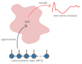

# Synthetic Data Generation

## Overview
MPSTime also supports the generation of synthetic time-series instances, $\mathbf{x} = (x_1, x_2, \dots, x_T)$, by sequentially sampling each time-series value $x_t$ for $t = 1, 2, \dots, T$ from the learned joint distribution $p(\mathbf{x})$, encoded by the trained matrix-product state (MPS).

The synthetic data generation process follows a sequential sampling approach that mirrors half of the imputation algorithm. 
The first value $x_1$
is sampled directly from the unconditional joint distribution with no prior observations. 
All subsequent values $x_2, x_3, \dots x_T$
are then sampled from their respective conditional distributions: $p(x_2∣x_1)$, $p(x_3 | x_1, x_2)$ and so forth, where each new value is conditioned on all previously generated values in the sequence.


## The Inverse Transform Sampling Algorithm (ITS)
To sample each data point $x_t$ from its respective distribution, either conditional in the case of $t > 1$, or unconditional for $t = 1$, MPSTime relies on a numerical technique known as inverse transform sampling (ITS), which works with the cumulative distribution function $F$ of a random variable. 
Here, we consider the case of sampling $x_1$, the value at the first time point $t = 1$, from the full joint distribution, $p(x)$, approximated by an $T$ site MPS. 

To obtain the marginal distribution $p(x_1)$, the remaining $T-1$ sites of the MPS are traced out to give the reduced density matrix (RDM) at site 1, $\rho_1$:


The cumulative distribution function, $F_i(x)$ is then evaluated as:

```math
F_i(x) = \frac{1}{Z} \int_a^{x} \phi^{\dagger}(x')\rho_i \phi_i(x')dx',
```

where $Z$ is chosen so that $F_{s_i}(b) = 1$, $a$ is the lower bound on the support of the encoding domain $[a,b]$, $\rho_i$ is the RDM at site $i$ and $\phi_i$ is the feature map (e.g., Legendre, Fourier, etc.) at site $i$. 

Next, we sample a random value from a uniform distribution defined on the interval $[0, 1]$ i.e., $u \sim U(0, 1)$.
Using the inverse cumulative distribution function, $F_i^{-1}(u)$, we select the value $x_i$ such that $F_i(x_i) = u$.
In practice, the inverse cumulative distribution function can be evaluated numerically using a root-finding algorithm (as in MPSTime).

# Demo
To demonstrate how MPSTime can be used to perform synthetic data generation, we will consider a dataset of simulated noisy, trendy sinusoids (NTS) on which to train an MPS.
In practice, you would typically train on your own real dataset, not on synthetic data as shown here.

First, we will generate a synthetic dataset of NTS with positive trend and moderate noise:
```@setup synthdatagen
using MPSTime, Random, Plots, Plots.PlotMeasures
rng = Xoshiro(1); # fix rng seed
ntimepoints = 100; # specify number of samples per instance.
ntrain_instances = 300; # specify num training instances
X_train = trendy_sine(ntimepoints, ntrain_instances; sigma=0.2, slope=3, period=15, rng=rng)[1];

opts = MPSOptions(
    d=12, 
    chi_max=40, 
    nsweeps=5,
    sigmoid_transform=false # disabling preprocessing generally improves imputation performance.
) 
mps, info, test_states = fitMPS(X_train, opts);
```
Similar to the imputation problem, we initialize a synthetic data generation problem:
```@example synthdatagen
synth = init_synthgen_problem(mps, X_train)
nothing # hide

```

A summary of the synthetic data generation problem setup is printed to verify the model parameters and dataset information.
For __multi-class__ data, you can pass `y_test` to `init_synthgen_problem` in order to exploit the labels / class information while doing imputation.

### Generating Trajectories
To generate synthetic time-series instances (i.e., trajectories), we can call the `MPS_generate` function.
There are several options:
 - `class::Integer`: The class of the time-series instance we are going to generate, leave as zero for "unlabelled" data (i.e., all data belong to the same class).
- `seed`: The seed for the random number generator when sampling trajectories. Set for reproducibility. Defaults to `nothing` which uses a different random seed with each call. 
- `num_trajectories::Integer`: The number of time-series intances to generate.
- `inverse_transform::Bool`: Whether to transform the generated data back to the original data domain. Defualt is `true`.
- `rejection_threshold::Float64`: Number of WMADs allowed between adjacent points. Setting this low helps suppress rapidly varying trajectories that occur by bad luck. Defaults to 2.0.
- `max_trials`: Number of attempts allowed to make guesses conform to rejection_threshold before giving up. Defaults to 10.

Here, by default, a single trajectory will be generated by sampling from the joint distribution approximated by the MPS unless multiple trajectories are specified via `num_trajectories`.
Note that due to the stochastic nature of the sampling algorithm, repeatedly calling `MPS_generate` will result in different trajectories each time.
For reproducibility, we can fix the random number generator seed by passing the keyword `seed` i.e., `MPS_generate(synth; seed=42)`.
For demonstration purposes, we will fix the number of trajectories to three with `num_trajectories = 3` and the seed as `seed = 42`.
Since this is an unsupervised problem with a single "class", we do not need to specify a class MPS from which to generate our synthetic data. 
All other options will be left to defaults (recommended):
```@example synthdatagen
ts = MPS_generate(synth; num_trajectories=3, seed=42)
```

A single vector output is returned from `MPS_generate` which contains the generated trajectories (length $N$ for $N$ trajectories of $T$ samples each).
To plot the generated time series, we can call the `plot` function:
```@example synthdatagen
plot(ts, label=:none)
xlabel!("sample", )
ylabel!("x")
title!("Synthetic trajectories")
savefig("figs_generated/imputation/synthdatagen_multitrajexample.svg") # hide
nothing # hide
```


Let's compare the synthetic data to the training data:
```@example synthdatagen
p1 = plot(ts, label=:none, xlabel="sample", ylabel="x", title="Synthetic trajectories")
# plot the first three from the training set for qualitative comparison...
p2 = plot(X_train[1:3, :]', label=:none, xlabel="sample", ylabel="x", title="Real training data")
plot(p1, p2, layout=(1, 2), size=(1200, 400), left_margin=8mm, bottom_margin=8mm)
savefig("figs_generated/imputation/synthdatagen_comparison.svg") # hide
nothing # hide
```

## Docstrings
```@docs
init_synthgen_problem(::TrainedMPS, ::Matrix)
MPS_generate
```
