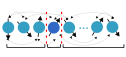
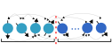
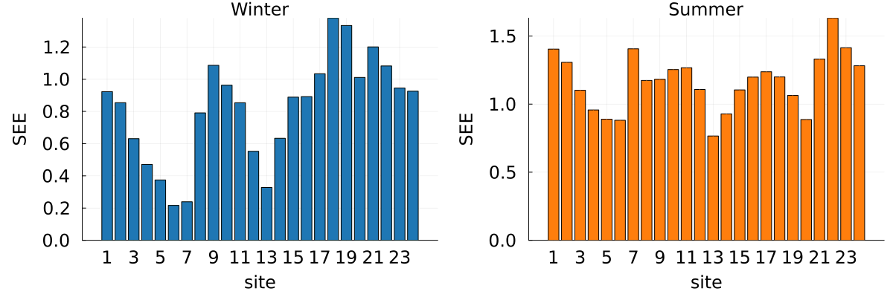

# Tools

## Entanglement Entropy
### Overview
In quantum many-body physics, the [entanglement entropy (EE)](https://en.wikipedia.org/wiki/Entropy_of_entanglement) determines the extent to which two partitions of the collective quantum system are entangled.
More simply, the EE can be thought of as quantifying the information shared between subsystem $A$ and subsystem $B$ within a many-body system.
In practice, the EE is computed as the [von Neumman entropy](https://en.wikipedia.org/wiki/Von_Neumann_entropy) of the reduced density matrix for any of the two subsystems ($A$ or $B$). 
An EE of zero implies that there is no entanglement between the subsystems.

We provide functions for two types of EE: (i) single-site entanglement entropy (SEE), and (ii) bipartite entanglement entropy (BEE):
#### (1) Single-site entanglement entropy (SEE)
The single-site entanglement entropy (SEE) quantifies the degree of entanglement between a single site (time-point) in the MPS and all other sites (time points).
Given a particular site in the MPS, $i$, the SEE is then specified by the von Neumann entropy of the reduced density matrix [RanCompressedSensing2020, LiuEntanglementFeatureExtract2021](@cite):
```math
S_\textrm{SEE} = -\mathrm{tr}\ \rho_i \log \rho_i\,,
```
where ``\rho_i`` is the reduced density matrix (rdm) at site ``i``, obtained by tracing over all sites except for the ``i``-th site:
```math
\rho_i = Tr_{/i} \ket{\psi}\bra{\psi}\,,
```
and ``\ket{\psi}`` is the MPS.
Using the 1D spin-chain as an illustrative example, the SEE between a single site (dark blue) and the rest of the system (light blue) can be depicted as:



#### (2) Bipartite entanglement entropy (BEE)
The bipartite entanglement entropy (BEE) quantifies the quantum entanglement between two complementary subsystems of a matrix product state (MPS). 
For an MPS with ``N`` sites, we can create a bipartition by splitting the system at any bond ``l``, resulting in region ``A`` (sites ``1`` to ``l``) and region ``B`` (sites ``l+1`` to ``N``).
The BEE can be expressed using the singular values of the [Shmidt decomposition](https://en.wikipedia.org/wiki/Schmidt_decomposition) of either of the two subsystems:
```math
\ket{\psi} = \sum_i \alpha_i \ket{u_i}_A
\otimes \ket{v_i}_B\,,
```
where ``\alpha_i`` are the Schmidt coefficients (singular values) satisfying ``\sum_i \alpha_i^2 = 1``, ``\ket{u_i}_A`` and ``\ket{v_i}_B`` are orthonormal states in subsystem ``A`` and ``B``, respectively.
The BEE is then given by the von Neumann entropy [LiuEntanglementFeatureExtract2021](@cite):
```math
S_\textrm{BEE} = -\sum_i \alpha_i^2 \log \alpha_i^2\,.
```
The BEE can be represented schematically using the 1D spin chain analogy where the red dotted line denotes the bipartition, the light blue particles represent subsystem ``A`` and the dark blue represent subsystem ``B``:




### Bipartite Entanglement Entropy (BEE)
Given a trained MPS (for either classification or imputation), we can compute the bipartite entanglement entropy (BEE) using
the [`bipartite_spectrum`](@ref) function:
```Julia
# train the MPS as usual
mps, _, _ = fitMPS(...);
bees = bipartite_spectrum(mps);
``` 
A vector is returned where each entry contains the BEE spectrum for the class-specific MPS. 
For example, in the case of a two class problem, we obtain the individual BEE spectrums for the class 0 MPS and the class 1 MPS. 
For an unsupervised problem with only a single class, there is only a single BEE spectrum. 
#### Example
To illustrate how we might use the BEE in a typical analysis, consider an example involving real world time series from the [ItalyPowerDemand](https://www.timeseriesclassification.com/description.php?Dataset=ItalyPowerDemand) (IPD) UCR dataset. 
There are two classes corresponding to the power demand during: (i) the winter months; (ii) the summer months. 
For this example, we will train an MPS to classify between summer and winter time-series data:
```Julia
# load in the training data
using JLD2
ipd_load = jldopen("ipd_original.jld2", "r");
    X_train = read(ipd_load, "X_train")
    y_train = read(ipd_load, "y_train")
    X_test = read(ipd_load, "X_test")
    y_test = read(ipd_load, "y_test")
close(ipd_load)
opts = MPSOptions(d=10, chi_max=40, nsweeps=10; init_rng=4567)
mps, _, _ = fitMPS(X_train, y_train, X_test, y_test, opts)
```
Let's take a look at the training dataset for this problem:


Using the trained MPS, we can then inspect the BEE for the class 0 (winter) and class 1 (summer) MPS individually:
```Julia
bees = bipartite_spectrum(mps);
bee0, bee1 = bees
b1 = bar(bee0, title="Winter", label="", c=palette(:tab10)[1], xlabel="site", ylabel="entanglement entropy");
b2 = bar(bee1, title="Summer", label="", c=palette(:tab10)[2], xlabel="site", ylabel="entanglement entropy");
p = plot(b1, b2)
```


### Single-Site Entanglement Entropy (SEE)
Given a trained MPS, we can also compute the single-site entanglement entropy (SEE) using the [`single_site_spectrum`](@ref) function:
```Julia
# train MPS as usual
mps, _, _ = fitMPS(...);
sees = MPSTime.single_site_spectrum(mps);
```
As with the BEE, a vector is returned where each entry contains the SEE spectrum for the class-specific MPS. 
#### Example
Continuing our example from the BEE with the ItalyPowerDemand (IPD) dataset, we will now compute the single-site entanglement entropy (SEE) spectrum:
```Julia
sees = single_site_spectrum(mps);
see0, see1 = sees
b1 = bar(see0, title="Winter", label="", c=palette(:tab10)[1], xlabel="site", ylabel="SEE");
b2 = bar(see1, title="Summer", label="", c=palette(:tab10)[2], xlabel="site", ylabel="SEE");
p = plot(b1, b2)
```


## Missing Data Simulation
In the time-series imputation literature, time-series data can be categorised into one of three types based on the underlying process responsible for the missing data: (i) missing completely at random (MCAR); (ii) missing at random (MAR); or, (iii) missing not at random (MNAR).
A review of the various mechanisms in the univariate setting can be found in [this paper](https://ieeexplore.ieee.org/stamp/stamp.jsp?tp=&arnumber=8605316).

MPSTime provides implementations of all three mechanisms, adapted from the more typical multivariate setting to the case of univariate time-series data.
To generate synthetic missing data, the original (uncorrupted) univariate time-series instance is passed into a function which assigns a NaN value to time points determined by the missing data mechanism of choice. 


### Missing Completely at Random (MCAR)
To simulate missing completely at random (MCAR) data, the locations (time points) of missing points:
```Julia 
using MPSTime
using Random
Random.seed!(42)
pm = 0.5 # 50% data missing
X_clean = rand(100) # your data as a vector
X_corrupted, X_missing_inds = mcar(X_clean, pm)
```
The `mcar` function will return a copy of the time-series with NaN values at missing positions, and the indices of the missing values.
Let's plot the corrupted data:
```Julia
using Plots
p1 = plot(X_clean, xlabel="time", ylabel="x", label="", title="Original data");
p2 = plot(X_corrupted, xlabel="time", ylabel="x", label="", title="MCAR $(pm*100)% missing data");
plot(p1, p2, size=(1200, 300));
```


### Missing at Random (MCAR)
To simulate missing at random (MAR) data, use the ``mar`` function:
```Julia
X_corrupted, X_missing_inds = mar(X_clean, pm)
```
Plotting the corrupted data:


### Missing Not At Random (MNAR)
To simulate missing not at random (MNAR) data, use the ``mnar`` function:
```Julia
X_corrupted, X_missing_inds = mnar(X_train, pm)
```


## Docstrings
```@docs
MPSTime.single_site_spectrum
MPSTime.bipartite_spectrum
MPSTime.mcar
MPSTime.mar
MPSTime.mnar
```

## Internal Methods
```@docs
MPSTime.von_neumann_entropy
MPSTime.one_site_rdm
```
